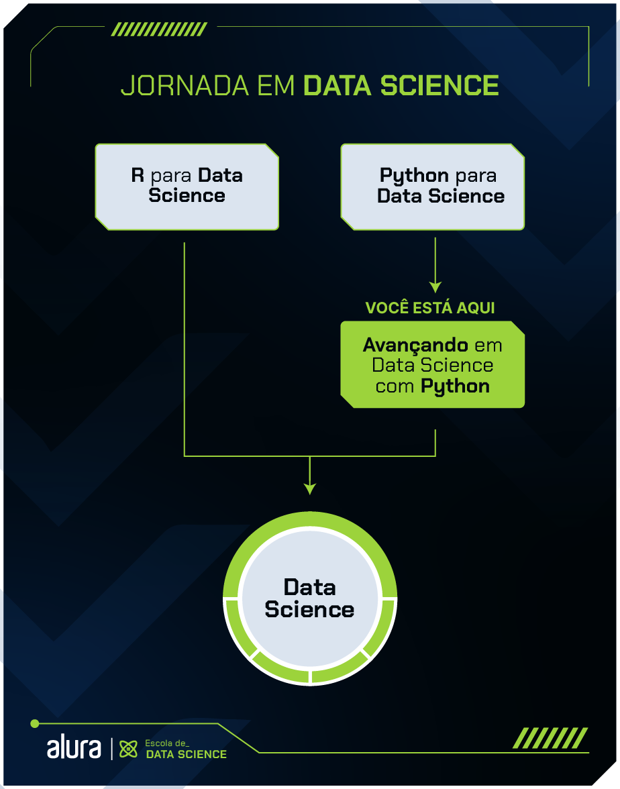

# 📊 Curso Alura: Formação Python para Data Science

Neste espaço, compilei todos os cursos que completei na **Formação Python para Data Science** da Alura.  
A formação é composta por 8 cursos, totalizando **69 horas** de conteúdo prático e teórico.

## 🗂 Estrutura do Projeto

O projeto está dividido em **duas partes principais**, conforme mostrado na imagem

### 📘 1. `data_main_one` — _Python para Data Science_

Nesta etapa, estão os cursos introdutórios que abordam a linguagem Python e suas bibliotecas fundamentais para análise e manipulação de dados.  
**Conteúdo incluído:**

- **Manipulacao_strings**: Manipulação de strings e exercícios relacionados.
- **Numpy**: Conceitos e práticas utilizando a biblioteca NumPy.
- **Pandas**: Análise de dados com a biblioteca Pandas, incluindo visualização de desafios e descrição no README.
- **PandasAgrupandoDados**: Exercícios focados em agrupar dados utilizando o Pandas.
- **Pandasformatos**: Trabalhando com diferentes formatos de dados no Pandas.
- **PythonData**: Introdução ao Python para manipulação de dados.
- **limpeza_trat_dados**: Finalizando o curso sobre limpeza e tratamento de dados.
- **transformação_manipulação**: Transformações e manipulação avançada de dados.

### 🚀 2. `data_avanced_two` — _Avançando em Data Science com Python_

Aqui estão os cursos mais avançados, focados em visualização e interpretação de dados, aplicando as bibliotecas **Matplotlib** e **Seaborn**:  
**Conteúdo incluído:**

- **a_graficos_Visualizacao_bibliotecas**: Introdução às principais bibliotecas de visualização;
- **b_comparação_distribuição**: Comparação e análise de distribuições estatísticas;
- **c_graficos_composicao_relacionamento**: Gráficos de relacionamento e composição de dados.

## 🧠 Bibliotecas Utilizadas

Durante os cursos, aprendi a utilizar as principais bibliotecas do ecossistema Python para Data Science, incluindo:

- **Pandas**: Para manipulação e análise de dados;
- **NumPy**: Para cálculos numéricos e operações com arrays;
- **Matplotlib** e **Seaborn**: Para criação de gráficos e visualizações de dados;
- **Jupyter Notebook**: Para organizar e compartilhar o código com visualizações interativas.

## 🎯 Objetivo

Este repositório é uma maneira de documentar meu aprendizado e servir como portfólio para projetos desenvolvidos na área de Data Science.  
Se tiver interesse em aprender mais ou colaborar, fique à vontade para explorar os arquivos e deixar sugestões!

---

**Autor**

## Raphael Garcia
